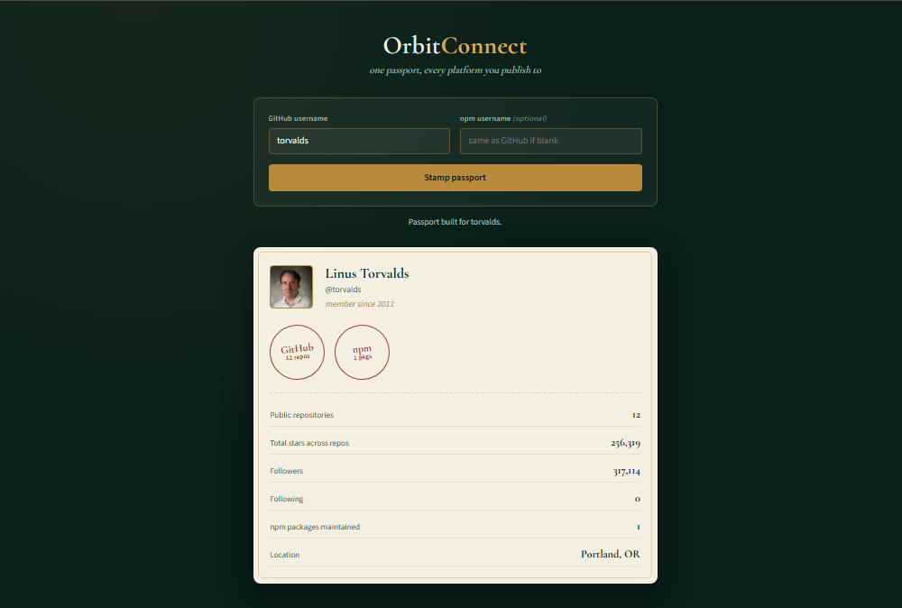

# OrbitConnect — Unified Developer Profile Aggregator

Enter a GitHub username and get back a "passport" — a single stamped profile that pulls together your GitHub repository footprint and your npm package history, so a recruiter or collaborator can see your public open-source presence in one place instead of hopping between sites.

**[Live demo →](https://arjayb.github.io/OrbitConnect/)**



## Features

- Look up any public GitHub account and pull their live profile data
- Auto-checks npm for packages under the same (or a supplied) username
- Passport-style UI with a "stamp" per platform — filled if found, dashed if not
- Aggregate ledger: total repos, total stars, followers, npm package count
- Handles the real edge cases of a public API: unknown usernames (404), rate limiting (403), and network failures, each with a clear message
- Zero dependencies — vanilla HTML, CSS, and JavaScript

## Why no backend?

The [GitHub REST API](https://docs.github.com/en/rest) and the [npm registry search API](https://github.com/npm/registry/blob/master/docs/REGISTRY-API.md) both serve public data over plain HTTPS with CORS enabled, so the browser can call them directly — no server needed to proxy requests or hide a key, because none is required for this kind of read-only public data.

**Rate limit:** unauthenticated GitHub requests are capped at 60 per hour, per IP address, which is fine for personal/portfolio use.

**Scope note:** GitLab support was left out of v1 because GitLab's public API has inconsistent CORS behavior from the browser — adding it would need a small serverless proxy, which would break the "no backend" premise of this build.

## Run it locally

Clone the repo and open `index.html` in a browser. No build step, no `npm install`.

```bash
git clone https://github.com/arjayb/OrbitConnect.git
cd OrbitConnect
open index.html   # or just double-click it
```

If your browser blocks `fetch` on the `file://` protocol, serve it with any static server instead:

```bash
python3 -m http.server 8000
# then visit http://localhost:8000
```

## Deploy to GitHub Pages

1. Push this repo to GitHub.
2. Go to **Settings → Pages**.
3. Under **Build and deployment**, set **Source** to `Deploy from a branch`, pick `main` and `/ (root)`.
4. Save — your app will be live at `https://<your-username>.github.io/OrbitConnect/` within a minute or two.

## Project structure

```
OrbitConnect/
├── index.html    # markup
├── style.css     # passport UI, stamp states, aggregate ledger
├── script.js     # GitHub + npm API calls, passport rendering, ledger totals
└── README.md
```

## Data source

Profile data comes from the public [GitHub REST API](https://docs.github.com/en/rest) (`/users/{username}` and `/users/{username}/repos`) and the public [npm registry search API](https://github.com/npm/registry/blob/master/docs/REGISTRY-API.md) (maintainer search). No authentication, no API key, no user data is stored — every lookup is a fresh, live request.

## License

MIT — use this however you'd like.
